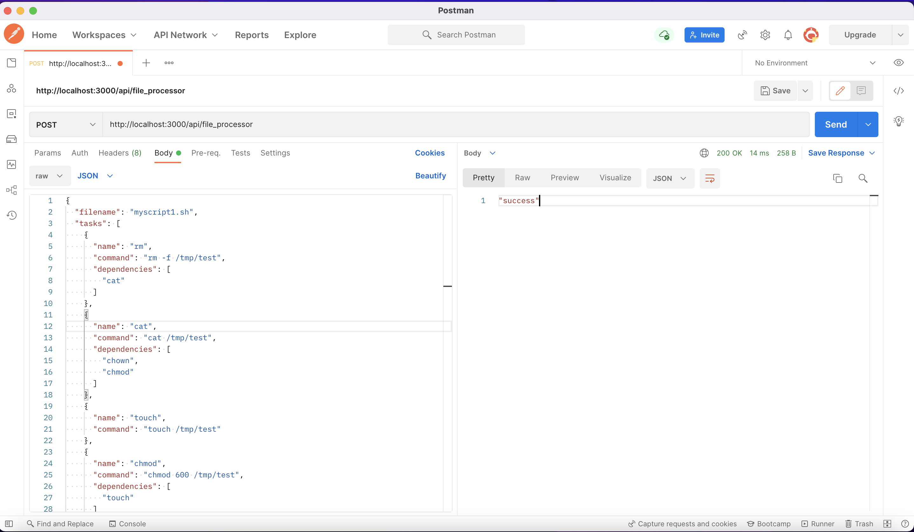
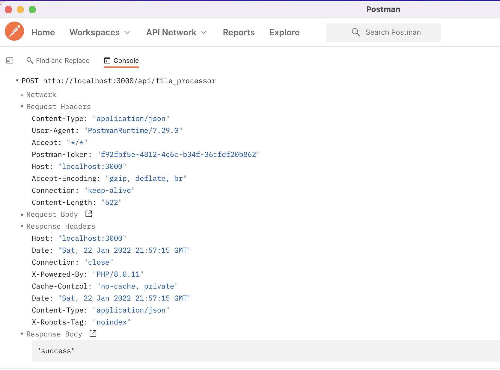
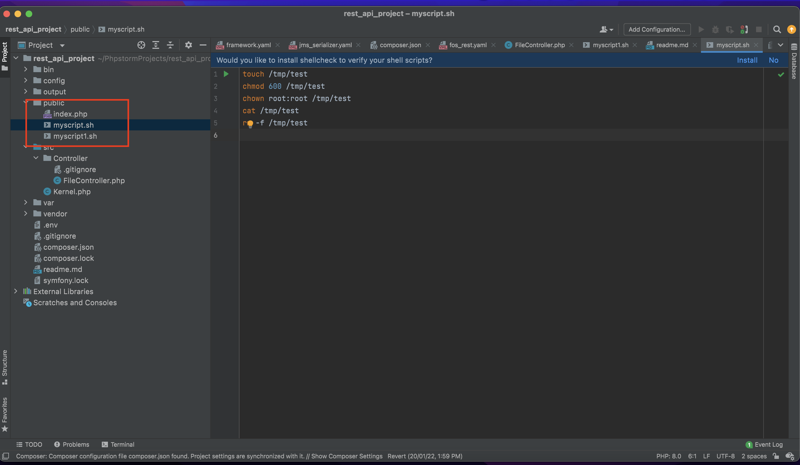

# Symfony RestAPI Project

## Problem Statement

A service that handles POST requests. Each request contains JSON in his body. The JSON contains a filename + the list of tasks. The task has a name, command and list of dependencies to other tasks. The service should convert the tasks to a commands list and put it to the specified file. The commands should be ordered according to dependencies, if the command does not have dependencies it may be placed to any position.  Please feel free to use any PHP frameworks here. The example:


```
{
  "filename": "myscript1.sh",
  "tasks": [
    {
      "name": "rm",
      "command": "rm -f /tmp/test",
      "dependencies": [
        "cat"
      ]
    },
    {
      "name": "cat",
      "command": "cat /tmp/test",
      "dependencies": [
        "chown",
        "chmod"
      ]
    },
    {
      "name": "touch",
      "command": "touch /tmp/test"
    },
    {
      "name": "chmod",
      "command": "chmod 600 /tmp/test",
      "dependencies": [
        "touch"
      ]
    },
    {
      "name": "chown",
      "command": "chown root:root /tmp/test",
      "dependencies": [
        "touch"
      ]
    }
  ]
}
```

Should be converted to  myscript.sh with the following content:

```
touch /tmp/test
chmod 600 /tmp/test
chown root:root /tmp/test
cat /tmp/test
rm -f /tmp/test
```

## Setup

To install dependencies through composer run this command.
```
composer install
```

## API Server Start

Run this command to start API server.
```
php -S localhost:3000 -t public
```

**API Endpoint**:

```
http://localhost:3000/api/file_processor
```

The business login has been written in `src/Controller/FileController.php`.

Postman output screenshot attached.




Output file has been saved in `public` folder. Please refer the screenshot.


